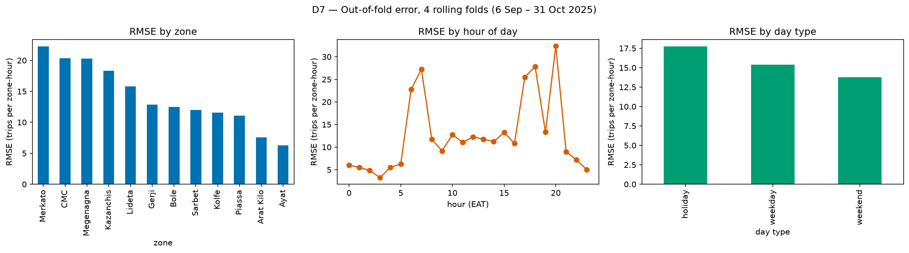

# D — Modeling & Evaluation

Source: `notebooks/04_modeling_and_evaluation.ipynb` (code in `src/modeling.py`). All scores are on chronological splits of the train file; the test file is never scored.

**Split dates.** Main validation: train < 2025-10-18, validate 18–31 Oct 2025. Rolling origin: cutoffs 2025-09-06, 2025-09-20, 2025-10-04, 2025-10-18 (14-day validation each). Tuning folds: 2025-09-20, 2025-10-04.

**Final model:** LightGBM, configuration `+ drop suspect targets`. Mean rolling-origin RMSE 9.60 / MAE 6.20 on rows not flagged as corrupted (all rows: 14.72 / 6.54). Uses weather and event features (Rule 5) and only forecast-time features (Rule 6). Saved to `models/final_model.joblib`; predictions in `submission/team_ride_minds_submission.csv`.

## D1 — Baselines

On 18–31 Oct the mean predictor scores RMSE 29.47 / MAE 20.89; the seasonal-naive profile cuts that roughly in half (all history: RMSE 15.36, last 4 weeks: RMSE 15.52). Zone × weekday × hour seasonality explains most of the variance, so any real model has to beat **15.36** to be worth deploying.

| model | rmse | mae |
|---|---|---|
| mean predictor | 29.469 | 20.891 |
| seasonal naive (zone×dow×hour, all history) | 15.36 | 7.444 |
| seasonal naive (zone×dow×hour, last 4 weeks) | 15.525 | 7.231 |

## D2 — Model comparison

Winner on 18–31 Oct: **HistGradientBoosting** (RMSE 13.61, MAE 6.60, -11.4% vs seasonal naive). Gradient boosting wins because demand is a product of interactions (zone × hour × weekday, rain × zone type, event type × phase) that trees pick up without hand-made crosses, and it handles the NaN lags of gaps natively. Ridge cannot model those interactions; the random forest averages deep trees and is slower and smoother on spikes. HistGradientBoosting edges LightGBM by 0.08 RMSE; we keep LightGBM as the final family because it is as accurate within noise, much faster to tune, and supports the Poisson objective.

| model | rmse | mae | train_s | rmse_vs_seasonal_naive_pct |
|---|---|---|---|---|
| HistGradientBoosting | 13.611 | 6.597 | 6.955 | -11.391 |
| LightGBM | 13.689 | 6.663 | 4.192 | -10.881 |
| Ridge (one-hot zone/hour/dow) | 14.934 | 7.504 | 0.698 | -2.776 |

## D3 — Rolling-origin validation

LightGBM: RMSE 14.96 ± 2.16 (mean ± sd over 4 folds); seasonal naive: 16.77 ± 1.39. LightGBM wins in 4/4 folds. The fold-to-fold spread (sd 2.16) is larger than the average gap to the baseline (1.81): which fortnight you test on matters more than small model tweaks, so differences of a few tenths on one split should not be over-read. Worst fold: cutoff 2025-10-04 (RMSE 18.16); 23% of its squared error falls on 2025-10-07 (CMC 07:00 actual 592 vs pred 56; Megenagna 18:00 actual 58 vs pred 101; Merkato 12:00 actual 72 vs pred 109). Calendar entries that day: Road closure (construction) (road_closure), Road closure (construction) (road_closure).

| cutoff | n_valid | lightgbm_rmse | lightgbm_mae | seasonal_naive_rmse | seasonal_naive_mae | lgb_gain_pct |
|---|---|---|---|---|---|---|
| 2025-09-06 | 4000 | 14.32 | 6.677 | 16.814 | 8.106 | 14.836 |
| 2025-09-20 | 4005 | 13.654 | 7.063 | 16.245 | 8.462 | 15.947 |
| 2025-10-04 | 4009 | 18.157 | 6.975 | 18.659 | 7.18 | 2.692 |
| 2025-10-18 | 3999 | 13.689 | 6.663 | 15.36 | 7.444 | 10.881 |

## D4 — Feature availability & leakage audit

Excluded: active_drivers, avg_wait_min, avg_fare_birr (outcomes of demand, unknown for future hours), the master table's trips_lag_168 (needs trips from inside the forecast fortnight), data_type and identifiers. Adding drivers/wait drops validation RMSE from 13.69 to 11.43 — an inflated score that would vanish in production because nobody knows next Tuesday's driver count. The in-fortnight 1-week lag gives 13.50 (optimistic: it peeks at trips inside the forecast fortnight). A random 80/20 split scores 14.70: not lower here, because its test rows are spread over the whole year (including the spiky early-autumn weeks) rather than a calm late-October fortnight. It is still invalid, since it trains on hours after the ones it scores.

| column | group | known_at_forecast_time | used | note |
|---|---|---|---|---|
| zone_id | zone | yes | yes |  |
| hour | calendar | yes | yes |  |
| dow | calendar | yes | yes |  |
| is_weekend | calendar | yes | yes |  |
| day_of_month | calendar | yes | yes |  |
| is_payday_window | calendar | yes | yes |  |
| trend_day | trend/lag (≥14 days back) | yes | yes |  |
| lag_336 | trend/lag (≥14 days back) | yes | yes |  |
| lag_504 | trend/lag (≥14 days back) | yes | yes |  |
| lag_wk_mean | trend/lag (≥14 days back) | yes | yes |  |
| zone_level_2w | trend/lag (≥14 days back) | yes | yes |  |
| zone_hour_profile_4w | trend/lag (≥14 days back) | yes | yes |  |
| temp_c | weather | yes | yes | weather = forecast values for Nov (noisier than the observed values used in validation) |
| rain_mm | weather | yes | yes | weather = forecast values for Nov (noisier than the observed values used in validation) |
| rain_last_3h | weather | yes | yes | weather = forecast values for Nov (noisier than the observed values used in validation) |
| rain_class | weather | yes | yes | weather = forecast values for Nov (noisier than the observed values used in validation) |
| humidity_pct | weather | yes | yes | weather = forecast values for Nov (noisier than the observed values used in validation) |
| wind_kmh | weather | yes | yes | weather = forecast values for Nov (noisier than the observed values used in validation) |
| is_public_holiday | events | yes | yes |  |
| is_school_break | events | yes | yes |  |
| in_event_window | events | yes | yes |  |
| n_events | events | yes | yes |  |
| event_attendance | events | yes | yes |  |
| hours_to_event_start | events | yes | yes |  |
| ev_pre | events | yes | yes |  |
| ev_during | events | yes | yes |  |
| ev_post | events | yes | yes |  |
| ev_football_match | events | yes | yes |  |
| ev_concert | events | yes | yes |  |
| ev_conference | events | yes | yes |  |
| ev_exhibition | events | yes | yes |  |
| ev_sports_run | events | yes | yes |  |
| ev_road_closure | events | yes | yes |  |
| lag_168 | lag | only days 1–7 of the horizon | D8 candidate (week-1 model only) | trips one week earlier; unknown for 8–14 Nov |
| trips_lag_168 (master table) | lag | no (for days 8–14) | no | uses actual trips from inside the forecast fortnight; replaced by horizon-safe lags |
| active_drivers | operations | no | no | consequence of demand; only in history |
| avg_wait_min | operations | no | no | consequence of demand vs supply |
| avg_fare_birr | operations | no | no | observed after trips happen (used only for revenue in the demo) |
| data_type | weather meta | yes | no | always 'observed' in train, 'forecast' in test — pure distribution-shift flag |
| record_id / row_id / matched_event_ids | identifiers | yes | no | IDs; event ids are encoded via the event flags |

| variant | rmse | mae |
|---|---|---|
| final feature set (honest) | 13.689 | 6.663 |
| + active_drivers, avg_wait_min (LEAKY) | 11.426 | 3.362 |
| + 1-week lag from actuals inside the fortnight (LEAKY) | 13.495 | 6.624 |
| random 80/20 split (contrast only, not valid) | 14.695 | 5.937 |

## D5 — Ablation

Mean rolling RMSE: base 16.43; weather -0.56 (-3.4%), events -0.90 (-5.5%), both -1.48 (-9.0%). Both joins pay off and their gains roughly add up, so the integration work in A was worth it. Event gains are concentrated in few zone-hours (matches, concerts, closures), so they move RMSE more than MAE.

| config | n_features | rmse_18_31_oct | rolling_rmse_mean | rolling_mae_mean | delta_rmse_vs_i | delta_mae_vs_i |
|---|---|---|---|---|---|---|
| (i) calendar + zone + trend/lag | 12 | 14.327 | 16.434 | 7.843 | 0.0 | 0.0 |
| (ii) + weather | 18 | 14.045 | 15.872 | 7.373 | -0.562 | -0.47 |
| (iii) + events | 27 | 14.091 | 15.531 | 7.237 | -0.903 | -0.606 |
| (iv) + weather + events | 33 | 13.689 | 14.955 | 6.844 | -1.479 | -0.998 |

## D6 — Tuning

Optuna TPE, 8 trials (trial 0 = defaults) over num_leaves 15–127, learning_rate 0.02–0.1, n_estimators 200–700, min_child_samples 5–100, subsample 0.6–1, colsample 0.5–1, reg_lambda 1e-3–10, objective {L2, Poisson}; score = mean RMSE on the 20 Sep and 4 Oct folds, excluding rows flagged as corrupted (D7) so a handful of impossible values do not steer the search (1.4 min). Tuning-fold clean RMSE 10.27 → 10.27; on the untouched 18–31 Oct fortnight clean RMSE 9.76 → 9.76 (all rows 13.69 → 13.69). Best: num_leaves=63, learning_rate=0.05, n_estimators=400, min_child_samples=20, subsample=0.8, colsample_bytree=0.8, reg_lambda=1, objective=regression.

| params | tuning_folds_rmse_clean | rmse_18_31_oct | rmse_clean_18_31_oct | mae_18_31_oct |
|---|---|---|---|---|
| default | 10.268 | 13.689 | 9.763 | 6.663 |
| tuned | 10.268 | 13.689 | 9.763 | 6.663 |

| parameter | best |
|---|---|
| num_leaves | 63 |
| learning_rate | 0.05 |
| n_estimators | 400 |
| min_child_samples | 20 |
| subsample | 0.8 |
| colsample_bytree | 0.8 |
| reg_lambda | 1.0 |
| objective | regression |

## D7 — Error analysis

(a) Error scales with volume: Merkato has the highest RMSE (22.3), while MAE as % of mean demand ranges 19–23% across zones. By hour, RMSE peaks at 20:00 and is lowest at 03:00. Day type: holiday 17.7, weekday 15.4, weekend 13.8. Days 8–14 of the horizon score 13.07 vs 16.84 for days 1–7; overall bias (actual − pred) is +0.17 trips. (b) The top 1% of zone-hours produce 67% of the squared error, and the 24 validation rows flagged as suspect alone produce 55%. Top-10 groups: suspected corrupted record ×10. The flagged rows have a normal driver count but ~10× the trips, which points to corrupted trip counts rather than real demand: no feature could anticipate them, and training on them pulls neighbouring forecasts up.

| zone | n | mean_trips | rmse | mae | bias(actual-pred) | mae_pct_of_mean |
|---|---|---|---|---|---|---|
| Merkato | 1331.0 | 46.983 | 22.25 | 9.211 | 1.262 | 19.606 |
| CMC | 1328.0 | 30.677 | 20.381 | 6.862 | 0.666 | 22.367 |
| Megenagna | 1334.0 | 44.873 | 20.309 | 8.729 | 0.002 | 19.453 |
| Kazanchis | 1333.0 | 38.713 | 18.341 | 8.886 | -0.05 | 22.953 |
| Lideta | 1334.0 | 33.219 | 15.813 | 7.132 | -0.441 | 21.471 |
| Gerji | 1339.0 | 28.553 | 12.878 | 5.777 | 0.437 | 20.234 |
| Bole | 1331.0 | 44.683 | 12.478 | 9.13 | -0.608 | 20.433 |
| Sarbet | 1335.0 | 25.374 | 12.018 | 5.362 | 0.509 | 21.133 |
| Kolfe | 1337.0 | 26.681 | 11.596 | 5.438 | 0.268 | 20.38 |
| Piassa | 1338.0 | 33.105 | 11.103 | 6.333 | 0.002 | 19.13 |
| Arat Kilo | 1336.0 | 23.649 | 7.546 | 4.79 | -0.022 | 20.253 |
| Ayat | 1337.0 | 20.955 | 6.255 | 4.513 | -0.028 | 21.538 |

| day_type | n | mean_trips | rmse | mae | bias(actual-pred) |
|---|---|---|---|---|---|
| holiday | 570.0 | 29.449 | 17.731 | 8.205 | 1.748 |
| weekday | 11154.0 | 34.682 | 15.393 | 6.974 | 0.154 |
| weekend | 4289.0 | 29.512 | 13.791 | 6.328 | -0.012 |

| horizon_day | n | mean_trips | rmse | mae | bias(actual-pred) |
|---|---|---|---|---|---|
| days 1–7 | 8012.0 | 32.816 | 16.838 | 6.948 | 0.257 |
| days 8–14 | 8001.0 | 33.407 | 13.068 | 6.74 | 0.075 |

| zone | pickup_hour_eat | trips | pred | err | active_drivers | rain_mm | matched_event_ids | hypothesis |
|---|---|---|---|---|---|---|---|---|
| Megenagna | 2025-09-10 20:00 | 640.0 | 47.6 | 592.4 | 56.0 | 1.8 |  | suspected corrupted record: 11.4 trips per active driver (normal ≈1.3), trips look ~10x inflated |
| CMC | 2025-10-07 07:00 | 592.0 | 56.3 | 535.7 | 56.0 | 0.0 |  | suspected corrupted record: 10.6 trips per active driver (normal ≈1.3), trips look ~10x inflated |
| Merkato | 2025-10-18 06:00 | 528.0 | 49.8 | 478.2 | 49.0 | 0.0 |  | suspected corrupted record: 10.8 trips per active driver (normal ≈1.3), trips look ~10x inflated |
| Merkato | 2025-10-08 17:00 | 512.0 | 64.4 | 447.6 | 49.0 | 0.0 |  | suspected corrupted record: 10.4 trips per active driver (normal ≈1.3), trips look ~10x inflated |
| Gerji | 2025-10-13 20:00 | 424.0 | 45.1 | 378.9 | 31.0 | 0.0 |  | suspected corrupted record: 13.7 trips per active driver (normal ≈1.3), trips look ~10x inflated |
| Sarbet | 2025-10-10 18:00 | 408.0 | 50.9 | 357.1 | 38.0 | 0.0 |  | suspected corrupted record: 10.7 trips per active driver (normal ≈1.3), trips look ~10x inflated |
| CMC | 2025-10-14 20:00 | 392.0 | 47.0 | 345.0 | 32.0 | 0.0 |  | suspected corrupted record: 12.2 trips per active driver (normal ≈1.3), trips look ~10x inflated |
| Kolfe | 2025-09-27 18:00 | 376.0 | 43.1 | 332.9 | 29.0 | 0.0 | EVT-0126 | suspected corrupted record: 13.0 trips per active driver (normal ≈1.3), trips look ~10x inflated |
| Kazanchis | 2025-10-25 18:00 | 464.0 | 161.3 | 302.7 | 40.0 | 0.0 | EVT-0149 | suspected corrupted record: 11.6 trips per active driver (normal ≈1.3), trips look ~10x inflated |
| Lideta | 2025-10-03 07:00 | 368.0 | 67.5 | 300.5 | 32.0 | 0.0 |  | suspected corrupted record: 11.5 trips per active driver (normal ≈1.3), trips look ~10x inflated |

## D8 — Response to findings

Change in mean rolling clean RMSE vs the tuned model: + drop suspect targets -0.472; + cap spikes q99.5 -0.411; + drop suspect targets + cap spikes q99.5 -0.364. Adopted **+ drop suspect targets** as the final configuration (clean RMSE 10.07 → 9.60; all-row RMSE 14.96 → 14.72).

| variant | rolling_rmse_mean | rolling_mae_mean | rolling_rmse_clean_mean | rolling_rmse_clean_sd | rolling_mae_clean_mean | rmse_clean_18_31_oct | delta_rmse_clean_vs_tuned |
|---|---|---|---|---|---|---|---|
| tuned (D6) | 14.955 | 6.844 | 10.07 | 0.655 | 6.504 | 9.763 | 0.0 |
| + drop suspect targets | 14.715 | 6.539 | 9.599 | 0.808 | 6.195 | 9.029 | -0.472 |
| + cap spikes q99.5 | 14.759 | 6.55 | 9.659 | 0.943 | 6.207 | 8.956 | -0.411 |
| + drop suspect targets + cap spikes q99.5 | 14.808 | 6.548 | 9.707 | 0.984 | 6.204 | 8.895 | -0.364 |

## D9 — Plain-language metric

Across the four validation fortnights, the forecast for one zone in one hour is typically off by about **6.2 trips** (MAE), 19% of the average 32.8 trips per zone-hour. The RMSE of 9.6 trips (29% of mean) weights the occasional bigger miss, such as an event that draws more people than usual. At ~1.3 trips per driver-hour, a typical miss is **4.8 drivers** per zone per hour (≈7 in a bad hour). Compared with the seasonal-naive rule (RMSE 12.1), the model removes about 21% of the error. These figures exclude the 0.16% of history rows that look corrupted; including them, RMSE is 14.7 and MAE 6.5.

| cutoff | n_valid | rmse | mae | rmse_clean | mae_clean |
|---|---|---|---|---|---|
| 2025-09-06 | 4000 | 14.176 | 6.444 | 9.736 | 6.189 |
| 2025-09-20 | 4005 | 13.394 | 6.793 | 10.687 | 6.578 |
| 2025-10-04 | 4009 | 17.858 | 6.596 | 8.942 | 5.966 |
| 2025-10-18 | 3999 | 13.434 | 6.324 | 9.029 | 6.048 |
